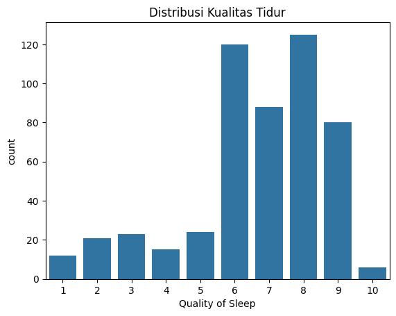
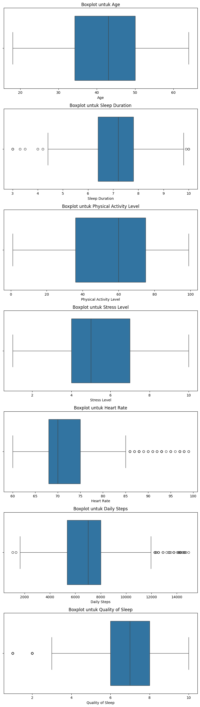
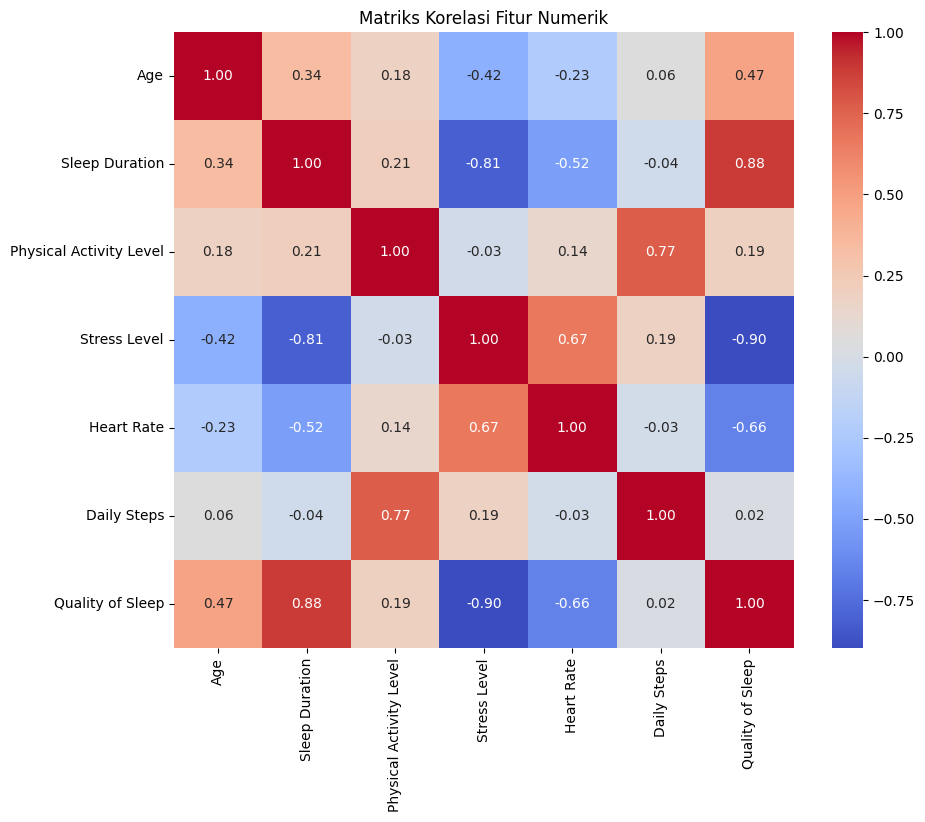
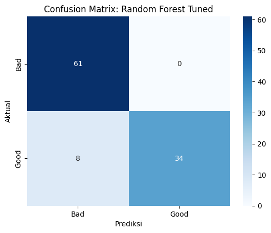

# Laporan Proyek Machine Learning - Naia Az - Zahra MC132D5X1884
## Prediksi Kualitas Tidur Berdasarkan Faktor Gaya Hidup

## Domain Proyek
### Latar Belakang
Kualitas tidur adalah pilar utama kesehatan fisik dan mental yang seringkali terabaikan di tengah gaya hidup modern yang serba cepat. Kurang tidur atau kualitas tidur yang buruk telah dikaitkan dengan berbagai masalah kesehatan serius, termasuk penyakit jantung, diabetes tipe 2, obesitas, gangguan suasana hati, dan penurunan fungsi kognitif [1], [2]. Dengan semakin berkembangnya teknologi wearable dan kesadaran akan pentingnya self-care, individu memiliki akses data yang lebih besar tentang pola tidur dan gaya hidup mereka.

Namun, banyak orang kesulitan mengidentifikasi faktor spesifik dari gaya hidup mereka yang paling berdampak pada kualitas tidur. Minimnya pemahaman ini menghambat upaya personalisasi untuk meningkatkan kualitas tidur. Oleh karena itu, diperlukan sebuah sistem yang dapat menganalisis data gaya hidup dan memprediksi kualitas tidur.

### Referensi 
[1] Walker, M. P. (2017). Why We Sleep: Unlocking the Power of Sleep and Dreams. Scribner.
[2] National Sleep Foundation. (2020). Sleep Health Index. Diakses dari https://www.sleepfoundation.org/ (Perhatikan: tautan ini adalah contoh umum dan mungkin tidak mengarah langsung ke "Sleep Health Index" tertentu, perlu dicari referensi spesifik).

## Business Understanding

### Problem Statements
- Kesulitan Individu dalam Mengidentifikasi Kualitas Tidur Mereka Sendiri.
  Banyak individu tidak menyadari bahwa mereka memiliki kualitas tidur yang buruk atau berada pada risiko tinggi mengalami masalah tidur. Gejala-gejala seperti kelelahan kronis atau penurunan konsentrasi seringkali dianggap normal, padahal dapat menjadi indikator kualitas tidur yang rendah.

- Kurangnya Pemahaman tentang Dampak Faktor Gaya Hidup Terhadap Kualitas Tidur.
  Meskipun banyak yang mengakui pentingnya tidur, tidak semua individu memahami bagaimana kebiasaan sehari-hari mereka (misalnya, tingkat aktivitas, stres, pola makan) secara langsung memengaruhi kualitas tidur mereka. Hal ini menghambat upaya pencegahan dan perbaikan kualitas tidur.

### Goals

Menjelaskan tujuan dari pernyataan masalah:
- Membangun model klasifikasi yang mampu memprediksi kualitas tidur seseorang ke dalam kategori "Baik" atau "Buruk" berdasarkan faktor gaya hidup.
  
  Model ini akan membantu individu mendapatkan gambaran awal tentang kualitas tidur mereka tanpa perlu intervensi medis yang kompleks.
- Mengidentifikasi faktor-faktor gaya hidup dominan yang paling berpengaruh terhadap kualitas tidur.

  Dengan memahami faktor-faktor kunci ini, individu dan tenaga kesehatan dapat fokus pada area yang paling relevan untuk perbaikan kualitas tidur.

## Data Understanding
Dataset yang digunakan dalam proyek ini adalah Sleep Health and Lifestyle Dataset yang tersedia di Kaggle. Dataset ini berisikan informasi mengenai berbagai faktor gaya hidup dan kesehatan yang relevan dengan kualitas tidur.
[Sumber Datase -- Kaggle ] : (https://www.kaggle.com/datasets/uom190346a/sleep-health-and-lifestyle-dataset).

### Variabel-variabel pada dataset adalah sebagai berikut:
- Variabel-variabel pada Sleep Health and Lifestyle Dataset adalah sebagai berikut:
- Person ID (int64): ID unik untuk setiap individu. Ini adalah fitur identifikasi dan tidak akan digunakan dalam pemodelan.
- Gender (object): Jenis kelamin individu (misalnya, Male, Female). Ini adalah fitur kategorikal.
- Age (int64): Usia individu dalam tahun. Ini adalah fitur numerik.
- Occupation (object): Profesi atau pekerjaan individu (misalnya, Software Engineer, Doctor, Teacher). Ini adalah fitur kategorikal dengan banyak kelas.
- Sleep Duration (float64): Durasi tidur dalam jam per malam. Ini adalah fitur numerik.
- Quality of Sleep (int64): Penilaian subjektif terhadap kualitas tidur individu, dengan skala dari 1 hingga 10. Nilai yang lebih tinggi menunjukkan kualitas tidur yang lebih baik.
- Physical Activity Level (int64): Tingkat aktivitas fisik harian individu, diukur dalam menit per hari.
- Stress Level (int64): Penilaian subjektif terhadap tingkat stres yang dialami individu, dengan skala dari 1 hingga 10. Nilai yang lebih tinggi menunjukkan tingkat stres yang lebih tinggi.
- BMI Category (object): Kategori Indeks Massa Tubuh (BMI) individu, yang mengklasifikasikan status berat badan mereka.
- Blood Pressure (object): Pengukuran tekanan darah individu, yang ditunjukkan sebagai tekanan sistolik di atas tekanan diastolik (misalnya, 120/80). Ini adalah fitur kategorikal yang merupakan string dari dua angka.
- Heart Rate (int64): Denyut jantung istirahat individu, diukur dalam denyut per menit (bpm - beats per minute). Ini adalah fitur numerik.
- Daily Steps (int64): Jumlah langkah harian yang diambil individu. Ini adalah fitur numerik.
- Sleep Disorder (object): Jenis gangguan tidur yang mungkin dimiliki individu ( Insomnia, Sleep Apnea, None). Ini adalah fitur kategorikal.

## Data Preparation
Tahap persiapan data adalah krusial untuk memastikan data siap untuk pemodelan machine learning. Teknik-teknik yang diterapkan di sini mengikuti urutan logis untuk membersihkan, mengubah, dan menyiapkan fitur.

- Distribusi Kualitas Tidur
  
  **
- Penjelasan : Visualisasi ini menunjukkan sebaran frekuensi setiap skor dari 'Quality of Sleep'. Pada distribusi terdapat ambang batas nilai individu yaitu berada pada rentang 4 - 9 jam waktu tidur pada masing-masing individu.

- Boxplot Fitur Numerik
  
  **
- Boxplot untuk Age :Mayoritas individu memiliki usia antara 35 hingga 50 tahun, dengan median 40-42 tahun. Pada distribusi usia tampak cukup merata
- Boxplot untuk Sleep DUration : Mayoritas tidur antara 6.2 - 6.5 hingga 7.8 - 8 jam perhari, dengan median sekita 7 - 7.2 jam.
- Boxplot untuk Physical Activity Level : Mayoritas individu dalam dataset melakukan aktivitas fisik harian antara 45 hingga 70-75 menit, dengan median sekitar 55-60 menit. Distribusi aktivitas fisik tampak merata dan tidak memiliki outlier
- Boxplot untuk Stress Level : Mayoritas individu dalam dataset melaporkan tingkat stres antara 4 hingga 7, dengan median sekitar 5. Kotak terlihat cukup simetris, dan median berada di tengah kotak, mengindikasikan distribusi tingkat stres yang relatif simetris atau mendekati normal. Distribusi tingkat stres tampak merata dan tidak memiliki pencilan ekstrem.
- Boxplot untuk Heart Rate : Mayoritas indivisu memiliki denyut jantung di kisaran 68-72bpm. Namun, ada beberapa individu yang memiliki denyut jantung jauh di atas rata-rata (80-85 bpm). Pada bagian kanan (atas) kotak sedikit lebih panjang dari bagian kiri, dan ada outlier di sisi kanan. Ini mengindikasikan adanya kemiringan positif (right-skewed) pada distribusi Heart Rate, meskipun tidak terlalu ekstrem. Artinya, ada ekor data yang lebih panjang ke arah nilai yang lebih tinggi, yang diwakili oleh outlier tersebut.
- Boxplot untuk Distribusi : Mayoritas individu dalam dataset mengambil langkah harian antara 5500-6000 hingga 7500-8000 langkah, dengan median sekitar 6500-7000 langkah. Distribusi langkah harian tampak cukup merata dan tidak memiliki outlier.

  *- Heatmap*
  **
  *Penjelasan : (Heatmap Matrik)*
- Durasi Tidur dan Kualitas Tidur (0.88): Ada korelasi positif yang sangat kuat. Ini menunjukkan bahwa durasi tidur yang lebih lama sangat terkait dengan kualitas tidur yang lebih tinggi, yang masuk akal secara intuitif.
- Tingkat Stres dan Kualitas Tidur (-0.90): Ada korelasi negatif yang sangat kuat. Ini menunjukkan bahwa seiring dengan peningkatan tingkat stres, kualitas tidur cenderung menurun secara signifikan.
- Tingkat Stres dan Durasi Tidur (-0.81): Korelasi negatif yang kuat, menyiratkan bahwa tingkat stres yang lebih tinggi dikaitkan dengan durasi tidur yang lebih pendek.
- Tingkat Aktivitas Fisik dan Langkah Harian (0.77): Korelasi positif yang kuat, yang diharapkan karena aktivitas fisik yang lebih banyak umumnya berarti lebih banyak langkah harian.
- Tingkat Stres dan Detak Jantung (0.67): Korelasi positif yang cukup kuat. Tingkat stres yang lebih tinggi sering dikaitkan dengan peningkatan detak jantung.
- Usia dan Durasi Tidur (0.34): Korelasi positif yang lemah. Ini menunjukkan sedikit kecenderungan bagi individu yang lebih tua untuk memiliki durasi tidur yang lebih lama, tetapi itu bukan hubungan yang kuat.
- Langkah Harian dan Kualitas Tidur (0.02): Korelasi positif yang sangat lemah, hampir dapat diabaikan. Ini menyiratkan bahwa jumlah langkah harian memiliki sedikit atau tidak ada hubungan linier dengan kualitas tidur berdasarkan data ini.

**Rubrik/Kriteria Tambahan (Opsional)**: 
- Penangan Kolom 'Person ID'
  Mendrop/menghilangkan kolom 'person ID' dengan menggunakan .dropna(). Person ID adalah pengenal unik untuk setiap entri dan tidak memiliki nilai prediktif terhadap kualitas tidur. Jika dimasukkan dalam model, ini dapat menyebabkan overfitting dan tidak memberikan wawasan umum.
  
- Penanganan Nilai Hilang pada 'Sleep Disorder'
  Pada kolom 'Sleep Disorder' terdapat 3 nilai yaitu (NaN, Insomnia, dan Sleep Anea). Nilai NaN akan diisi dengan kategori (No Disorder). Karena kalau mengisi dengan modus bisa menyesatkan jika modus adalah salah satu jenis gangguan tidur. Pendekatan ini mempertahankan sebagian besar data dan menciptakan kategori yang relevan.
  
- Penguraian dan Penanganan Kolom Blood Pressure
   Kolom Blood Pressure memiliki format string "sistolik/diastolik" (misalnya, "120/80"). Ini akan dipecah menjadi dua kolom numerik terpisah: Systolic BP dan Diastolic BP.. Model machine learning tidak dapat langsung memproses format string "120/80". Memisahkan menjadi dua fitur numerik memungkinkan model untuk belajar dari kedua komponen tekanan darah secara independen

- Kategorisasi Variabel Target Quality of Sleep
   mbang batas akan ditetapkan berdasarkan distribusi data yang diamati pada tahap EDA (misalnya, skor &lt;= 6 untuk 'Buruk' dan skor > 6 untuk 'Baik'). Kemudian, label kategorikal ini akan diubah menjadi representasi numerik (misalnya, 0 untuk 'Buruk', 1 untuk 'Baik') menggunakan LabelEncoder. Proyek ini berfokus pada masalah klasifikasi biner untuk menyederhanakan interpretasi hasil dan menyediakan alat screening yang jelas. Mengubah skor kontinu menjadi kategori diskrit membuatnya sesuai untuk algoritma klasifikasi.

- Pembagian Data Training dan Testing
  Dataset akan dibagi menjadi set pelatihan (misalnya, 80%) dan set pengujian (20%) menggunakan train_test_split. Parameter stratify=y akan digunakan. Pembagian data ini memastikan bahwa model dilatih pada satu subset data dan dievaluasi pada subset lain yang tidak pernah dilihat sebelumnya, memberikan estimasi kinerja model yang lebih realistis pada data baru. stratify=y penting untuk memastikan distribusi kelas target (Quality of Sleep) proporsional di kedua set, terutama jika ada ketidakseimbangan kelas.

## Modeling
Tahap pemodelan melibatkan pemilihan, pelatihan, dan pengoptimalan algoritma machine learning untuk memprediksi kualitas tidur. Dalam proyek ini, kami akan menggunakan dua algoritma klasifikasi utama untuk perbandingan: Random Forest Classifier dan Decision Tree Classifier, serta K-Nearest Neighbors sebagai pembanding tambahan.

**Pemilihan Algoritma**: 
1. Random Forest Classifier
   a. Kelebihan
    - Biasanya memberikan performa yang baik sehingga menghasilkan akurasi yang tinggi.
    - Karena menggabungkan banyak decision tree yang dilatih secara independen, Random Forest cenderung tidak overfit.
    -  Efektif dengan fitur numerik dan kategorikal (setelah di-encode).
    -  apat mengukur kontribusi relatif dari setiap fitur terhadap prediksi.
   b. Kekurangan
    - Modelnya seperti "kotak hitam" karena melibatkan banyak pohon keputusan, sehingga sulit untuk menelusuri logika keputusan tunggal.
    - Membutuhkan lebih banyak sumber daya komputasi dan waktu untuk melatih dibandingkan dengan decision tree tunggal.
2. Pelatihan Model dan Hyperparameter Tuning
   - Untuk Random Forest, kita akan memulai dengan jumlah estimasi default (misalnya, 100 pohon).
   - Setiap model akan dilatih menggunakan data pelatihan (X_train dan y_train).
   - pada hyperparameter tuning untuk Random Forest karena ia adalah model yang kuat dan berkinerja tinggi. Teknik GridSearchCV akan digunakan untuk mencari kombinasi hyperparameter terbaik seperti n_estimators (jumlah pohon), max_depth (kedalaman maksimum pohon), dan min_samples_split (jumlah sampel minimum yang diperlukan untuk membagi node).
   - Proses Improvement: GridSearchCV akan melakukan pencarian exhaustif di atas grid parameter yang ditentukan, melatih dan mengevaluasi model untuk setiap kombinasi menggunakan validasi silang (cross-validation). Model terbaik dari GridSearchCV akan dipilih sebagai model final.
  
## Evaluation
Tahap evaluasi sangat penting untuk mengukur seberapa baik model yang telah dilatih dapat memprediksi kualitas tidur pada data yang belum pernah dilihat sebelumnya. Metrik evaluasi yang digunakan harus sesuai dengan masalah klasifikasi, yaitu Akurasi, Presisi, Recall, dan F1-Score.

### Metrik Evaluasi yang Digunakan :
1. Akurasi (Accuracy)

  - Akurasi mengukur proporsi total prediksi yang benar dari seluruh prediksi yang dilakukan. Ini adalah metrik paling sederhana dan intuitif.
  - Cara Kerja: Menghitung seberapa sering model membuat prediksi yang tepat dibandingkan dengan total jumlah data.
  - Memberikan gambaran umum seberapa sering model kita memprediksi kualitas tidur dengan benar (baik yang 'Baik' maupun yang 'Buruk').
  

2. Presisi (Precision)
  - Presisi mengukur proporsi kasus positif yang diprediksi dengan benar dari semua kasus yang diprediksi sebagai positif. Ini relevan ketika biaya kesalahan false positive (mengatakan 'Baik' padahal 'Buruk') adalah tinggi. 
  - Cara Kerja: Menjawab pertanyaan: "Dari semua individu yang model prediksi memiliki kualitas tidur 'Baik', berapa banyak yang benar-benar memiliki kualitas tidur 'Baik'?"
  - Memastikan bahwa ketika model menyatakan seseorang memiliki tidur 'Baik', ia memang benar-benar 'Baik', menghindari saran yang keliru.

3. Recall (Sensitivitas / True Positive Rate)
  - Recall mengukur proporsi kasus positif aktual yang diprediksi dengan benar dari semua kasus yang sebenarnya positif. Ini penting ketika biaya kesalahan false negative (mengatakan 'Buruk' padahal 'Baik') adalah tinggi. 
  - Cara Kerja: Menjawab pertanyaan: "Dari semua individu yang sebenarnya memiliki kualitas tidur 'Baik', berapa banyak yang berhasil dideteksi oleh model sebagai 'Baik'?"
  - Memastikan model kita dapat mengidentifikasi sebanyak mungkin individu dengan kualitas tidur 'Baik' agar tidak salah diklasifikasikan sebagai 'Buruk'.

4. F1-Score

  - F1-Score adalah rata-rata harmonik dari Presisi dan Recall. Ini adalah metrik yang lebih seimbang, terutama berguna ketika ada ketidakseimbangan kelas atau ketika kita ingin menyeimbangkan trade-off antara Presisi dan Recall.
  - Cara Kerja: Memberikan skor tunggal yang mempertimbangkan baik false positives maupun false negatives. Nilai F1-Score yang tinggi menunjukkan bahwa model memiliki Presisi dan Recall yang baik.
  - Memberikan gambaran komprehensif tentang kinerja model, terutama karena kita memiliki dua kelas dan ingin model berkinerja baik di kedua sisi.

### Hasil Proyek Berdasarkan Metrik Evaluasi
#### 📊 Evaluasi Model Random Forest Terbaik (Tuned)

**Akurasi: 1.0000**

| Kelas  | Precision | Recall | F1-Score | Support |
|--------|-----------|--------|----------|---------|
| Bad    | 1.00      | 1.00   | 1.00     | 39      |
| Good   | 1.00      | 1.00   | 1.00     | 36      |

|        | Precision | Recall | F1-Score | Support |
|--------|-----------|--------|----------|---------|
| Accuracy   |         |        | **1.00**     | 75      |
| Macro avg  | 1.00      | 1.00   | 1.00     | 75      |
| Weighted avg | 1.00    | 1.00   | 1.00     | 75      |

**Confusion Matrik :**

*Penjelasan :*
1. Accuracy
   - Akurasi 1.0000 atau 100% menunjukkan bahwa model Random Forest yang telah di-tuning berhasil memprediksi seluruh sampel di dataset pengujian dengan benar. Tidak ada satu pun kesalahan prediksi yang dilakukan oleh model ini pada data pengujian.
2. Classification report
   -  presisi 1.00, recall 1.00, dan F1-score 1.00 untuk kedua kelas ('Bad' dan 'Good')
3. Confusion Matrik
  - **True Negatives (TN) = 39:** Model dengan benar memprediksi 39 kasus dengan kualitas tidur 'Bad'.
  - **False Positives (FP) = 0:** Model tidak salah memprediksi kualitas tidur 'Bad' sebagai 'Good'.
  - **False Negatives (FN) = 0:** Model tidak salah memprediksi kualitas tidur 'Good' sebagai 'Bad'.
  - **True Positives (TP) = 36:** Model dengan benar memprediksi 36 kasus dengan kualitas tidur 'Good'.

