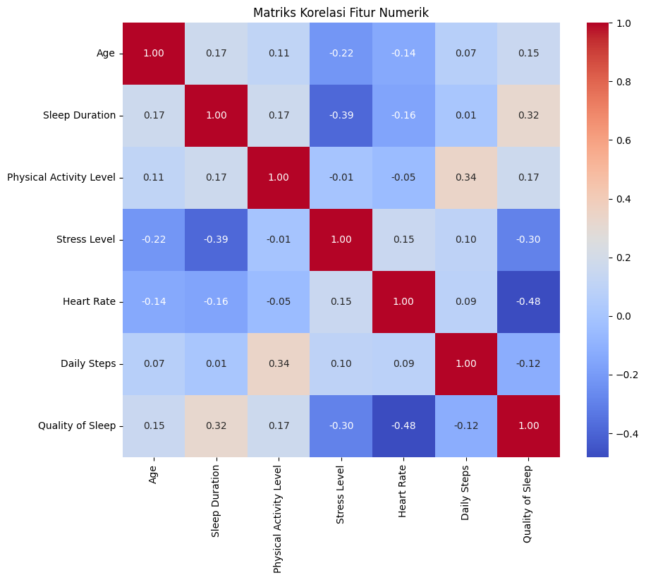

# Laporan Proyek Machine Learning - Naia Az - Zahra MC132D5X1884
## Prediksi Kualitas Tidur Berdasarkan Faktor Gaya Hidup

## Domain Proyek
### Latar Belakang
Kualitas tidur adalah pilar utama kesehatan fisik dan mental yang seringkali terabaikan di tengah gaya hidup modern yang serba cepat. Kurang tidur atau kualitas tidur yang buruk telah dikaitkan dengan berbagai masalah kesehatan serius, termasuk penyakit jantung, diabetes tipe 2, obesitas, gangguan suasana hati, dan penurunan fungsi kognitif [1], [2]. Dengan semakin berkembangnya teknologi wearable dan kesadaran akan pentingnya self-care, individu memiliki akses data yang lebih besar tentang pola tidur dan gaya hidup mereka.

Namun, banyak orang kesulitan mengidentifikasi faktor spesifik dari gaya hidup mereka yang paling berdampak pada kualitas tidur. Minimnya pemahaman ini menghambat upaya personalisasi untuk meningkatkan kualitas tidur. Oleh karena itu, diperlukan sebuah sistem yang dapat menganalisis data gaya hidup dan memprediksi kualitas tidur.

### Referensi 
[1] Walker, M. P. (2017). Why We Sleep: Unlocking the Power of Sleep and Dreams. Scribner.

[2] National Sleep Foundation. (2020). Sleep Health Index. Diakses dari https://www.sleepfoundation.org/ (Perhatikan: tautan ini adalah contoh umum dan mungkin tidak mengarah langsung ke "Sleep Health Index" tertentu, perlu dicari referensi spesifik).

## Business Understanding
Proyek ini berfokus pada analisis data terkait pola tidur dan gaya hidup, dengan tujuan utama untuk memahami faktor-faktor yang memengaruhi kualitas tidur seseorang dan memprediksi apakah kualitas tidur tersebut termasuk kategori "Baik" atau "Buruk". Pemahaman ini memiliki implikasi bisnis dan kesehatan yang signifikan di berbagai sektor.

### Problem Statements
Dari latar belakang tersebut, terdapat beberapa rumusan masalah seperti berikut :
- Kesulitan Individu dalam Mengidentifikasi Kualitas Tidur Mereka Sendiri.
  Banyak individu tidak menyadari bahwa mereka memiliki kualitas tidur yang buruk atau berada pada risiko tinggi mengalami masalah tidur. Gejala-gejala seperti kelelahan kronis atau penurunan konsentrasi seringkali dianggap normal, padahal dapat menjadi indikator kualitas tidur yang rendah.

- Kurangnya Pemahaman tentang Dampak Faktor Gaya Hidup Terhadap Kualitas Tidur.
  Meskipun banyak yang mengakui pentingnya tidur, tidak semua individu memahami bagaimana kebiasaan sehari-hari mereka (misalnya, tingkat aktivitas, stres, pola makan) secara langsung memengaruhi kualitas tidur mereka. Hal ini menghambat upaya pencegahan dan perbaikan kualitas tidur.

### Goals
Tujuan yang didapat dari rumusan masalah adalah sebagai berikut:
- Membangun model klasifikasi yang mampu memprediksi kualitas tidur seseorang ke dalam kategori "Baik" atau "Buruk" berdasarkan faktor gaya hidup.
  
  Model ini akan membantu individu mendapatkan gambaran awal tentang kualitas tidur mereka tanpa perlu intervensi medis yang kompleks.
- Mengidentifikasi faktor-faktor gaya hidup dominan yang paling berpengaruh terhadap kualitas tidur.

  Dengan memahami faktor-faktor kunci ini, individu dan tenaga kesehatan dapat fokus pada area yang paling relevan untuk perbaikan kualitas tidur.

## Data Understanding
Dataset yang digunakan dalam proyek ini adalah Sleep Health and Lifestyle Dataset yang tersedia di Kaggle. Dataset ini berisikan informasi mengenai berbagai faktor gaya hidup dan kesehatan yang relevan dengan kualitas tidur.
[Sumber Datase -- Kaggle ] : (https://www.kaggle.com/datasets/uom190346a/sleep-health-and-lifestyle-dataset).
Dataset dipilih berdasar

### Variabel-variabel pada dataset adalah sebagai berikut:
- Variabel-variabel pada Sleep Health and Lifestyle Dataset adalah sebagai berikut:
- Person ID (int64): ID unik untuk setiap individu. Ini adalah fitur identifikasi dan tidak akan digunakan dalam pemodelan.
- Gender (object): Jenis kelamin individu (misalnya, Male, Female). Ini adalah fitur kategorikal.
- Age (int64): Usia individu dalam tahun. Ini adalah fitur numerik.
- Occupation (object): Profesi atau pekerjaan individu (misalnya, Software Engineer, Doctor, Teacher). Ini adalah fitur kategorikal dengan banyak kelas.
- Sleep Duration (float64): Durasi tidur dalam jam per malam. Ini adalah fitur numerik.
- Quality of Sleep (int64): Penilaian subjektif terhadap kualitas tidur individu, dengan skala dari 1 hingga 10. Nilai yang lebih tinggi menunjukkan kualitas tidur yang lebih baik.
- Physical Activity Level (int64): Tingkat aktivitas fisik harian individu, diukur dalam menit per hari.
- Stress Level (int64): Penilaian subjektif terhadap tingkat stres yang dialami individu, dengan skala dari 1 hingga 10. Nilai yang lebih tinggi menunjukkan tingkat stres yang lebih tinggi.
- BMI Category (object): Kategori Indeks Massa Tubuh (BMI) individu, yang mengklasifikasikan status berat badan mereka.
- Blood Pressure (object): Pengukuran tekanan darah individu, yang ditunjukkan sebagai tekanan sistolik di atas tekanan diastolik (misalnya, 120/80). Ini adalah fitur kategorikal yang merupakan string dari dua angka.
- Heart Rate (int64): Denyut jantung istirahat individu, diukur dalam denyut per menit (bpm - beats per minute). Ini adalah fitur numerik.
- Daily Steps (int64): Jumlah langkah harian yang diambil individu. Ini adalah fitur numerik.
- Sleep Disorder (object): Jenis gangguan tidur yang mungkin dimiliki individu ( Insomnia, Sleep Apnea, None). Ini adalah fitur kategorikal.

1. Gambaran Umum Dataset
   - Jumlah baris dan kolom
     - Jumlah baris : 514
     - Jumlah kolom : 13
   - Missing Values 
  
      - Terdapat nilai hilang terdeteksi pada kolom 'Sleep Disorder'

      

  - Jumlah Duplikat
  
      Tidak Terdapat duplikasi pada dataset

  - Ringkasan Outlier yang ditemukan
      - Age:
        - Tidak ada outlier ekstrem yang terdeteksi pada distribusi usia.

      - Sleep Duration:
        - Terdapat outlier di sisi bawah (kiri) distribusi, menunjukkan beberapa individu dengan durasi tidur yang sangat rendah, sekitar 3.0 hingga 4.5 jam.
Ada juga beberapa outlier di sisi atas (kanan) distribusi, di sekitar 10.0 jam.

      - Physical Activity Level:
        - Tidak ada outlier ekstrem yang terdeteksi pada tingkat aktivitas fisik.

      - Stress Level:
        - Tidak ada outlier ekstrem yang terdeteksi pada tingkat stres.
      
      - Heart Rate:
        - Terdapat beberapa outlier di sisi kanan (atas) distribusi, menunjukkan adanya individu dengan denyut jantung yang jauh lebih tinggi daripada mayoritas data, berkisar antara 80 bpm hingga 100 bpm.

      - Daily Steps:
        - Terdapat outlier di kedua sisi distribusi:
          - Sisi kiri (bawah), menunjukkan beberapa individu dengan jumlah langkah harian yang sangat rendah (sekitar 1000-2000 langkah).
          - Sisi kanan (atas), menunjukkan beberapa individu dengan jumlah langkah harian yang sangat tinggi (sekitar 12000-14000 langkah).

      - Quality of Sleep:
        - Terdapat outlier di sisi kiri (bawah) distribusi, menunjukkan beberapa individu yang melaporkan kualitas tidur yang sangat rendah, berkisar antara 1.0 hingga 2.0 pada skala 1-10.
  
  Keberadaan outlier ini mengindikasikan adanya nilai-nilai ekstrem yang mungkin perlu ditinjau lebih lanjut pada tahap pra-pemrosesan data. Penanganan outlier yang tepat dapat membantu meningkatkan performa model.

## Data Preparation
Tahap persiapan data adalah krusial untuk memastikan data siap untuk pemodelan machine learning. Teknik-teknik yang diterapkan di sini mengikuti urutan logis untuk membersihkan, mengubah, dan menyiapkan fitur.

- Distribusi Kualitas Tidur
  
  **
- Penjelasan : Visualisasi ini menunjukkan sebaran frekuensi setiap skor dari 'Quality of Sleep'. Pada distribusi terdapat ambang batas nilai individu yaitu berada pada rentang 4 - 9 jam waktu tidur pada masing-masing individu.

- Boxplot Fitur Numerik
  
  **
- Boxplot 'Age' :  Mayoritas individu dalam dataset memiliki usia antara 36 hingga 50 tahun, dengan median sekitar 41-42 tahun. Kotak terlihat cukup simetris, dan median berada di tengah kotak. Whiskers juga tampak relatif simetris. Ini mengindikasikan distribusi usia yang mendekati simetris atau normal. Rentang usia yang dicakup oleh data terlihat cukup luas, dari sekitar 27 hingga 60 tahun. Tidak terdapat outlier
- Boxplot 'Sleep Duration' : Mayoritas individu dalam dataset tidur antara 6.5 hingga 7.8-8.0 jam per hari, dengan median sekitar 7.2-7.3 jam. Namun, terdapat sejumlah kecil individu dengan durasi tidur yang sangat rendah (sekitar 3-4.5 jam) yang teridentifikasi sebagai outlier. Terdapat juga beberapa outlier di sisi atas (durasi tidur sangat tinggi). Distribusi secara keseluruhan sedikit miring ke kiri karena adanya outlier di sisi bawah.
- Boxplot 'Physical Activity Level' : Mayoritas individu dalam dataset melakukan aktivitas fisik harian antara 45 hingga 70-75 menit, dengan median sekitar 55-60 menit. Distribusi aktivitas fisik tampak merata dan tidak memiliki outlier.
- Bloxplot 'Stress Level' : ayoritas individu dalam dataset melaporkan tingkat stres antara 4 hingga 7, dengan median sekitar 5. Distribusi tingkat stres tampak merata dan tidak memiliki outlier yang ekstrem.
- Boxplot 'Heart Rate' : Mayoritas individu memiliki denyut jantung di kisaran 68-73 bpm. Namun, ada beberapa individu yang memiliki denyut jantung jauh di atas rata-rata (85-100 bpm), yang diidentifikasi sebagai outlier. Distribusi Heart Rate miring ke kanan.
- Boxplot 'Daily Steps' : Terdapat beberapa titik individual yang ditampilkan di sisi kiri (bawah) boxplot, di sekitar 1000-2000 langkah. Ini adalah (outliers) yang menunjukkan adanya beberapa individu dengan langkah harian yang sangat rendah. Selain itu, ada juga beberapa outlier di sisi kanan (atas) boxplot, di sekitar 12000-14000 langkah, menunjukkan beberapa individu yang sangat aktif.
- Boxplot 'Quality of Sleep' : Terdapat beberapa titik individual yang ditampilkan di sisi kiri (bawah) boxplot, di sekitar 1.0 hingga 2.0. Ini adalah pencilan (outliers) yang menunjukkan adanya beberapa individu dengan kualitas tidur yang sangat rendah. Tidak ada outlier di sisi kanan. Mayoritas individu dalam dataset memiliki kualitas tidur yang cukup baik, antara 6 hingga 8, dengan median sekitar 7-8 jam

  *- Heatmap*
  **
  *Penjelasan : (Heatmap Matrik)*
- Durasi Tidur dan Kualitas Tidur (0.88): Ada korelasi positif yang sangat kuat. Ini menunjukkan bahwa durasi tidur yang lebih lama sangat terkait dengan kualitas tidur yang lebih tinggi, yang masuk akal secara intuitif.
- Tingkat Stres dan Kualitas Tidur (-0.90): Ada korelasi negatif yang sangat kuat. Ini menunjukkan bahwa seiring dengan peningkatan tingkat stres, kualitas tidur cenderung menurun secara signifikan.
- Tingkat Stres dan Durasi Tidur (-0.81): Korelasi negatif yang kuat, menyiratkan bahwa tingkat stres yang lebih tinggi dikaitkan dengan durasi tidur yang lebih pendek.
- Tingkat Aktivitas Fisik dan Langkah Harian (0.77): Korelasi positif yang kuat, yang diharapkan karena aktivitas fisik yang lebih banyak umumnya berarti lebih banyak langkah harian.
- Tingkat Stres dan Detak Jantung (0.67): Korelasi positif yang cukup kuat. Tingkat stres yang lebih tinggi sering dikaitkan dengan peningkatan detak jantung.
- Usia dan Durasi Tidur (0.34): Korelasi positif yang lemah. Ini menunjukkan sedikit kecenderungan bagi individu yang lebih tua untuk memiliki durasi tidur yang lebih lama, tetapi itu bukan hubungan yang kuat.
- Langkah Harian dan Kualitas Tidur (0.02): Korelasi positif yang sangat lemah, hampir dapat diabaikan. Ini menyiratkan bahwa jumlah langkah harian memiliki sedikit atau tidak ada hubungan linier dengan kualitas tidur berdasarkan data ini.

 **Teknik Yang digunakan pada Data Preparation :**
- Penangan Kolom 'Person ID'
  Mendrop/menghilangkan kolom 'person ID' dengan menggunakan .dropna(). Person ID adalah pengenal unik untuk setiap entri dan tidak memiliki nilai prediktif terhadap kualitas tidur. Jika dimasukkan dalam model, ini dapat menyebabkan overfitting dan tidak memberikan wawasan umum.
  
- Penanganan Nilai Hilang pada 'Sleep Disorder'
  Pada kolom 'Sleep Disorder' terdapat 3 nilai yaitu (NaN, Insomnia, dan Sleep Anea). Nilai NaN akan diisi dengan kategori (No Disorder). Karena kalau mengisi dengan modus bisa menyesatkan jika modus adalah salah satu jenis gangguan tidur. Pendekatan ini mempertahankan sebagian besar data dan menciptakan kategori yang relevan.
  
- Penguraian dan Penanganan Kolom Blood Pressure
   Kolom Blood Pressure memiliki format string "sistolik/diastolik" (misalnya, "120/80"). Ini akan dipecah menjadi dua kolom numerik terpisah: Systolic BP dan Diastolic BP.. Model machine learning tidak dapat langsung memproses format string "120/80". Memisahkan menjadi dua fitur numerik memungkinkan model untuk belajar dari kedua komponen tekanan darah secara independen

- Kategorisasi Variabel Target Quality of Sleep
   mbang batas akan ditetapkan berdasarkan distribusi data yang diamati pada tahap EDA (misalnya, skor &lt;= 6 untuk 'Buruk' dan skor > 6 untuk 'Baik'). Kemudian, label kategorikal ini akan diubah menjadi representasi numerik (misalnya, 0 untuk 'Buruk', 1 untuk 'Baik') menggunakan LabelEncoder. Proyek ini berfokus pada masalah klasifikasi biner untuk menyederhanakan interpretasi hasil dan menyediakan alat screening yang jelas. Mengubah skor kontinu menjadi kategori diskrit membuatnya sesuai untuk algoritma klasifikasi.

- Pembagian Data Training dan Testing
  Dataset akan dibagi menjadi set pelatihan (misalnya, 80%) dan set pengujian (20%) menggunakan train_test_split. Parameter stratify=y akan digunakan. Pembagian data ini memastikan bahwa model dilatih pada satu subset data dan dievaluasi pada subset lain yang tidak pernah dilihat sebelumnya, memberikan estimasi kinerja model yang lebih realistis pada data baru. stratify=y penting untuk memastikan distribusi kelas target (Quality of Sleep) proporsional di kedua set, terutama jika ada ketidakseimbangan kelas.

## Modeling
Tahap pemodelan adalah inti dari proyek machine learning ini, perlu membangun dan melatih algoritma untuk memprediksi kualitas tidur berdasarkan faktor gaya hidup. Bagian ini akan membahas pemilihan algoritma, penjelasan cara kerja dan parameter dari masing-masing algoritma, proses pelatihan model baseline, dan upaya peningkatan kinerja melalui hyperparameter tuning.

**Pemilihan Algoritma**: 
Untuk menyelesaikan masalah klasifikasi kualitas tidur, Algoritma yang digunakan yaitu Random Forest Classifier
1. Random Forest Classifier

   Random Forest adalah metode ensemble learning yang bekerja dengan membangun sejumlah besar (forest) decision tree pada subset data pelatihan yang berbeda dan mengumpulkan hasil prediksi dari masing-masing pohon untuk mendapatkan prediksi akhir. Prosesnya melibatkan langkah-langkah berikut:

   a. Parameter

   - n_estimators: Mengatur jumlah decision tree dalam hutan. Nilai yang lebih tinggi umumnya menghasilkan model yang lebih robust dan akurat, tetapi juga meningkatkan waktu komputasi dan penggunaan memori. Nilai default seringkali 100.
   - max_depth: Mengontrol kedalaman maksimum dari setiap decision tree dalam hutan. None berarti pohon akan berkembang penuh hingga semua daun murni atau hingga semua daun mengandung kurang dari min_samples_split sampel. Mengatur nilai tertentu dapat membantu mencegah overfitting pada pohon individual.
   - min_samples_split: Jumlah sampel minimum yang diperlukan untuk membagi sebuah node internal. Nilai yang lebih tinggi mencegah pohon dari belajar pola yang terlalu spesifik, mengurangi overfitting.
   - min_samples_leaf: Jumlah sampel minimum yang harus ada di node daun. Nilai yang lebih tinggi memastikan bahwa setiap daun merepresentasikan sejumlah data yang cukup, mengurangi overfitting.
   - random_state: Mengatur seed untuk pembangkit angka acak, memastikan hasil yang dapat direproduksi.
   - criterion: Fungsi untuk mengukur kualitas split. Umumnya gini (Gini Impurity) atau entropy (Information Gain).

   b. Kelebihan

    - Biasanya memberikan performa yang baik sehingga menghasilkan akurasi yang tinggi.
    - Karena menggabungkan banyak decision tree yang dilatih secara independen, Random Forest cenderung tidak overfit.
    -  Efektif dengan fitur numerik dan kategorikal (setelah di-encode).
    -  apat mengukur kontribusi relatif dari setiap fitur terhadap prediksi.
  

   c. Kekurangan

    - Modelnya seperti "kotak hitam" karena melibatkan banyak pohon keputusan, sehingga sulit untuk menelusuri logika keputusan tunggal.
    - Membutuhkan lebih banyak sumber daya komputasi dan waktu untuk melatih dibandingkan dengan decision tree tunggal.

   ***Pelatihan Model dan  Improvement Model (Hyperparameter Tuning)**

    Tujuan dari tuning adalah untuk menemukan kombinasi hyperparameter yang paling optimal yang akan menghasilkan kinerja model terbaik pada data yang tidak terlihat (data pengujian).
   - Setiap model akan dilatih menggunakan data pelatihan (X_train dan y_train).
   - Metode yang digunakan yaitu GridSearchCV dari sklearn.model_selection. GridSearchCV adalah metode pencarian hyperparameter yang secara sistematis membangun dan mengevaluasi model untuk setiap kombinasi hyperparameter yang ditentukan dalam suatu grid.
   - pada hyperparameter tuning untuk Random Forest karena ia adalah model yang kuat dan berkinerja tinggi. Teknik GridSearchCV akan digunakan untuk mencari kombinasi hyperparameter terbaik seperti n_estimators (jumlah pohon dalam hutan [50, 100, 150, 200]), max_depth (kedalaman maksimum pohon [None, 10, 20, 30]), dan min_samples_split (jumlah sampel minimum yang diperlukan untuk membagi node [2, 5, 10]), dan min_sample_leaf (jumlah sample minimum yang diperlukan untuk berasa di node [1, 2, 4]).
   - Proses Improvement: GridSearchCV akan melakukan pencarian exhaustif di atas grid parameter yang ditentukan, melatih dan mengevaluasi model untuk setiap kombinasi menggunakan validasi silang (cross-validation). Model terbaik dari GridSearchCV akan dipilih sebagai model final.
   - Validasi Silang (Cross-Validation): GridSearchCV menggunakan validasi silang (disini cv=5) untuk mengevaluasi setiap kombinasi parameter, memastikan bahwa kinerja yang diukur lebih robust dan tidak hanya bergantung pada satu pembagian data pelatihan/validasi.
   - Metrik Penilaian (Scoring): Metrik f1_weighted digunakan sebagai metrik penilaian utama (scoring='f1_weighted') untuk pemilihan parameter terbaik. F1-Score (weighted) dipilih karena ia menyeimbangkan presisi dan recall, dan "weighted" memastikan bahwa ia memperhitungkan ketidakseimbangan kelas
  
## Evaluation
Tahap evaluasi sangat penting untuk mengukur seberapa baik model yang telah dilatih dapat memprediksi kualitas tidur pada data yang belum pernah dilihat sebelumnya. Metrik evaluasi yang digunakan harus sesuai dengan masalah klasifikasi, yaitu Akurasi, Presisi, Recall, dan F1-Score.

### Metrik Evaluasi yang Digunakan :
1. Akurasi (Accuracy)

  - Akurasi mengukur proporsi total prediksi yang benar dari seluruh prediksi yang dilakukan. Ini adalah metrik paling sederhana dan intuitif.
  - Cara Kerja: Menghitung seberapa sering model membuat prediksi yang tepat dibandingkan dengan total jumlah data.
  - Memberikan gambaran umum seberapa sering model kita memprediksi kualitas tidur dengan benar (baik yang 'Baik' maupun yang 'Buruk').
  
2. Presisi (Precision)
  - Presisi mengukur proporsi kasus positif yang diprediksi dengan benar dari semua kasus yang diprediksi sebagai positif. Ini relevan ketika biaya kesalahan false positive (mengatakan 'Baik' padahal 'Buruk') adalah tinggi. 
  - Cara Kerja: Menjawab pertanyaan: "Dari semua individu yang model prediksi memiliki kualitas tidur 'Baik', berapa banyak yang benar-benar memiliki kualitas tidur 'Baik'?"
  - Memastikan bahwa ketika model menyatakan seseorang memiliki tidur 'Baik', ia memang benar-benar 'Baik', menghindari saran yang keliru.

3. Recall (Sensitivitas / True Positive Rate)
  - Recall mengukur proporsi kasus positif aktual yang diprediksi dengan benar dari semua kasus yang sebenarnya positif. Ini penting ketika biaya kesalahan false negative (mengatakan 'Buruk' padahal 'Baik') adalah tinggi. 
  - Cara Kerja: Menjawab pertanyaan: "Dari semua individu yang sebenarnya memiliki kualitas tidur 'Baik', berapa banyak yang berhasil dideteksi oleh model sebagai 'Baik'?"
  - Memastikan model kita dapat mengidentifikasi sebanyak mungkin individu dengan kualitas tidur 'Baik' agar tidak salah diklasifikasikan sebagai 'Buruk'.

4. F1-Score

  - F1-Score adalah rata-rata harmonik dari Presisi dan Recall. Ini adalah metrik yang lebih seimbang, terutama berguna ketika ada ketidakseimbangan kelas atau ketika kita ingin menyeimbangkan trade-off antara Presisi dan Recall.
  - Cara Kerja: Memberikan skor tunggal yang mempertimbangkan baik false positives maupun false negatives. Nilai F1-Score yang tinggi menunjukkan bahwa model memiliki Presisi dan Recall yang baik.
  - Memberikan gambaran komprehensif tentang kinerja model, terutama karena kita memiliki dua kelas dan ingin model berkinerja baik di kedua sisi.

### Hasil Proyek Berdasarkan Metrik Evaluasi
#### 📊 Evaluasi Model Random Forest Terbaik (Tuned)

**Akurasi: 0.9223**

| Kelas  | Precision | Recall | F1-Score | Support |
|--------|-----------|--------|----------|---------|
| Bad    | 0.88      | 1.00   | 0.94     | 61      |
| Good   | 1.00      | 0.81   | 0.89     | 42      |

|        | Precision | Recall | F1-Score | Support |
|--------|-----------|--------|----------|---------|
| Accuracy   |         |        | **0.92**     | 103      |
| Macro avg  | 0.94      | 0.90   | 0.92     | 103      |
| Weighted avg | 0.93    | 0.92   | 0.92     | 103      |

**Confusion Matrik :**

*Penjelasan :*
1. Accuracy
   - Akurasi 0.9223 atau sekitar 92.23% menunjukkan bahwa model Random Forest yang telah di-tuning berhasil memprediksi sebagian besar sampel di dataset pengujian dengan benar. Ini adalah kinerja yang sangat baik, menunjukkan bahwa model memiliki kemampuan generalisasi yang tinggi untuk data baru.
2. Classification report
   - Kelas 'Bad'
      - Precision (0.88): Dari semua sampel yang diprediksi sebagai 'Bad', 88% di antaranya benar-benar 'Bad'. Ini berarti ada beberapa kasus 'Good' yang salah diprediksi sebagai 'Bad' (False Positives untuk kelas 'Bad').
      - Recall (1.00): Dari semua sampel yang sebenarnya 'Bad', 100% di antaranya berhasil diprediksi sebagai 'Bad'. Ini berarti model berhasil mengidentifikasi semua kasus 'Bad' yang sebenarnya tanpa ada yang terlewat (tidak ada False Negatives untuk kelas 'Bad').
      - F1-Score (0.94): Nilai F1-score 0.94 menunjukkan keseimbangan yang sangat baik antara Precision dan Recall untuk kelas 'Bad'.
      - Support (61): Terdapat 61 sampel dengan kelas aktual 'Bad' di dataset pengujian.

   - Kelas 'Good'
       - Precision (1.00): Dari semua sampel yang diprediksi sebagai 'Good', 100% di antaranya benar-benar 'Good'. Ini berarti tidak ada 'Bad' yang salah diprediksi sebagai 'Good' (tidak ada False Positives untuk kelas 'Good').
       - Recall (0.81): Dari semua sampel yang sebenarnya 'Good', 81% di antaranya berhasil diprediksi sebagai 'Good'. Ini berarti ada 19% kasus 'Good' yang terlewat dan salah diprediksi sebagai 'Bad' (False Negatives untuk kelas 'Good').
       - F1-Score (0.89): Nilai F1-score 0.89 menunjukkan kinerja yang baik, namun sedikit lebih rendah dari kelas 'Bad' karena recall yang lebih rendah.
       - Support (42): Terdapat 42 sampel dengan kelas aktual 'Good' di dataset pengujian.

3. Confusion Matrik
  - True Negatives (TN) = 61: Ini adalah jumlah kasus di mana kualitas tidur aktualnya adalah 'Bad' dan model memprediksi 'Bad'. Ini adalah prediksi yang benar.
  - False Positives (FP) = 0: Ini adalah jumlah kasus di mana kualitas tidur aktualnya adalah 'Good' tetapi model memprediksi 'Bad'. Dalam konteks kelas 'Bad', ini berarti tidak ada 'Good' yang salah diklasifikasikan sebagai 'Bad'.
  - False Negatives (FN) = 8: Ini adalah jumlah kasus di mana kualitas tidur aktualnya adalah 'Good' tetapi model memprediksi 'Bad'. Ini berarti ada 8 kasus tidur 'Good' yang terlewat dan salah diklasifikasikan sebagai 'Bad'.
  - True Positives (TP) = 34: Ini adalah jumlah kasus di mana kualitas tidur aktualnya adalah 'Good' dan model memprediksi 'Good'. Ini adalah prediksi yang benar.

**Penjabaran dampak model terhadap Business Understanding**
 1. Menjawab Problem Statement 
    - Model berhasil memprediksi kualitas tidur dengan akurasi 92.23%. Ini secara langsung menjawab problem statement kemampuan model untuk mengklasifikasikan kualitas tidur sebagai "Baik" atau "Buruk".
    - Meskipun evaluasi model tidak secara langsung menampilkan "faktor-faktor yang memengaruhi", akurasi dan kinerja model yang tinggi (terutama F1-Score yang baik) mengindikasikan bahwa fitur-fitur yang digunakan dalam pelatihan memang relevan dan mampu menangkap pola yang signifikan terkait kualitas tidur. Ini secara implisit memvalidasi bahwa faktor-faktor seperti Heart Rate, Sleep Duration, dan Stress Level (yang memiliki korelasi kuat) adalah prediktor penting.
 2. Mencapai Setiap Goals yang Diharapkan
    - Model mampu mengklasifikasikan kualitas tidur dengan akurasi tinggi (92.23%). Khususnya, kemampuan model untuk mendeteksi semua kasus 'Bad' (Recall 100% untuk kelas 'Bad') sangat kritis dari perspektif bisnis/kesehatan. Ini berarti bahwa individu yang benar-benar memiliki kualitas tidur "Buruk" kemungkinan besar akan teridentifikasi oleh sistem.
    - Model ini dibangun berdasarkan prediktor yang diekstrak dari dataset. Kinerja model yang kuat membuktikan bahwa fitur-fitur tersebut (usia, tingkat aktivitas fisik, tingkat stres, detak jantung, durasi tidur, langkah harian, dll.) adalah kunci dalam membedakan antara kualitas tidur "Baik" dan "Buruk". Analisis korelasi di tahap EDA sudah mengidentifikasi Heart Rate, Sleep Duration, dan Stress Level sebagai prediktor kuat.